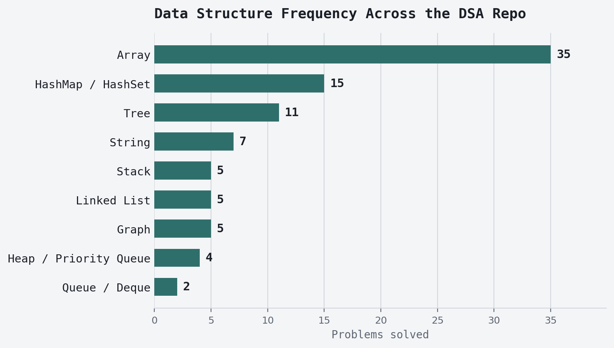

# Data Structures Used

All 89 problems in this repo, grouped by the primary data structure each solution is built on,
ranked by how often that structure shows up — most-used first.

| Rank | Data Structure | Problems |
| --- | --- | --- |
| 1 | Array | 35 |
| 2 | HashMap / HashSet | 15 |
| 3 | Tree | 11 |
| 4 | String | 7 |
| 5 | Stack | 5 |
| 6 | Linked List | 5 |
| 7 | Graph | 5 |
| 8 | Heap / Priority Queue | 4 |
| 9 | Queue / Deque | 2 |

## 1. Array (37)

Includes two-pointer, sliding-window, binary-search, and DP-table problems — all built on a
plain array as the underlying structure.

| Problem | Difficulty | Technique | JavaScript | Java |
| --- | --- | --- | --- | --- |
| Best Time to Buy and Sell Stock | Easy | Greedy scan | [js](js/e-besttimetobuysell.js) | [java](java/e-besttimetobuysell.java) |
| Binary Search | Easy | Binary search | [js](js/e-binarysearch.js) | [java](java/e-binarysearch.java) |
| Climbing Stairs | Easy | 1D DP | [js](js/e-climbingstairs.js) | [java](java/e-climbingstairs.java) |
| Find 2nd Largest Number | Easy | Single pass | [js](js/e-find2ndlargestnumber.js) | [java](java/e-find2ndlargestnumber.java) |
| First Bad Version | Easy | Binary search | [js](js/e-firstbadversion.js) | [java](java/e-firstbadversion.java) |
| Majority Element | Easy | Boyer–Moore | [js](js/e-majorityelement.js) | [java](java/e-majorityelement.java) |
| Maximum Average Subarray | Easy | Sliding window | [js](js/e-maxaveragesubarray.js) | [java](java/e-maxaveragesubarray.java) |
| Merge Sorted Array | Easy | Two pointers | [js](js/e-mergesortedarray.js) | [java](java/e-mergesortedarray.java) |
| Missing Number | Easy | Sum / XOR | [js](js/e-missingnumber.js) | [java](java/e-missingnumber.java) |
| Move Zeroes | Easy | Two pointers | [js](js/e-movezeroes.js) | [java](java/e-movezeroes.java) |
| Pascal's Triangle | Easy | Row build | [js](js/e-pascalstriangle.js) | [java](java/e-pascalstriangle.java) |
| Remove Duplicates from Sorted Array | Easy | Two pointers | [js](js/e-removeduplicates.js) | [java](java/e-removeduplicates.java) |
| Second Largest Element | Easy | Single pass | [js](js/e-secondlargest.js) | [java](java/e-secondlargest.java) |
| Single Number | Easy | XOR | [js](js/e-singlenumber.js) | [java](java/e-singlenumber.java) |
| Two Sum II - Sorted Array | Easy | Two pointers | [js](js/e-twosumsorted.js) | [java](java/e-twosumsorted.java) |
| Edit Distance | Hard | 2D DP | [js](js/h-editdistance.js) | [java](java/h-editdistance.java) |
| Median of Two Sorted Arrays | Hard | Binary search | [js](js/h-medianoftwosortedarrays.js) | [java](java/h-medianoftwosortedarrays.java) |
| Reverse Pairs | Hard | Merge sort | [js](js/h-reversepairs.js) | [java](java/h-reversepairs.java) |
| Trapping Rain Water | Hard | Two pointers | [js](js/h-trappingrainwater.js) | [java](java/h-trappingrainwater.java) |
| 3Sum | Medium | Two pointers | [js](js/m-3sum.js) | [java](java/m-3sum.java) |
| Coin Change | Medium | 1D DP | [js](js/m-coinchange.js) | [java](java/m-coinchange.java) |
| Combination Sum | Medium | Backtracking | [js](js/m-combinationsum.js) | [java](java/m-combinationsum.java) |
| Container With Most Water | Medium | Two pointers | [js](js/m-containerwithmostwater.js) | [java](java/m-containerwithmostwater.java) |
| Find Minimum in Rotated Sorted Array | Medium | Binary search | [js](js/m-findmininrotated.js) | [java](java/m-findmininrotated.java) |
| Find Peak Element | Medium | Binary search | [js](js/m-findpeakelement.js) | [java](java/m-findpeakelement.java) |
| House Robber | Medium | 1D DP | [js](js/m-houserobber.js) | [java](java/m-houserobber.java) |
| Koko Eating Bananas | Medium | Binary search | [js](js/m-kokoeatingbananas.js) | [java](java/m-kokoeatingbananas.java) |
| Longest Increasing Subsequence | Medium | DP | [js](js/m-longestincreasingsubsequence.js) | [java](java/m-longestincreasingsubsequence.java) |
| Max Path Sum in Matrix | Medium | 2D DP | [js](js/m-maxpathsummatrix.js) | [java](java/m-maxpathsummatrix.java) |
| Maximum Subarray | Medium | Kadane's | [js](js/m-maxsubarraysum.js) | [java](java/m-maxsubarraysum.java) |
| Meeting Rooms II | Medium | Sort + sweep | [js](js/m-meetingrooms.js) | [java](java/m-meetingrooms.java) |
| Merge Intervals | Medium | Sort + sweep | [js](js/m-mergeintervals.js) | [java](java/m-mergeintervals.java) |
| Product of Array Except Self | Medium | Prefix/suffix | [js](js/m-productexceptself.js) | [java](java/m-productexceptself.java) |
| Rotate Array | Medium | In-place reversal | [js](js/m-rotatearray.js) | [java](java/m-rotatearray.java) |
| Search in Rotated Sorted Array | Medium | Binary search | [js](js/m-searchrotated.js) | [java](java/m-searchrotated.java) |
| Sort an Array | Medium | Merge sort | [js](js/m-mergesort.js) | [java](java/m-mergesort.java) |
| Word Break | Medium | DP | [js](js/m-wordbreak.js) | [java](java/m-wordbreak.java) |

## 2. HashMap / HashSet (15)

Counting, lookup, and sliding-window-with-map problems.

| Problem | Difficulty | Technique | JavaScript | Java |
| --- | --- | --- | --- | --- |
| Two Sum | Easy | — | [js](js/e-2sum.js) | [java](java/e-2sum.java) |
| Contains Duplicate | Easy | — | [js](js/e-containsduplicate.js) | [java](java/e-containsduplicate.java) |
| Happy Number | Easy | Cycle detection via set | [js](js/e-happynumber.js) | [java](java/e-happynumber.java) |
| Valid Anagram | Easy | — | [js](js/e-validanagram.js) | [java](java/e-validanagram.java) |
| Minimum Window Substring | Hard | Sliding window | [js](js/h-minwindowsubstring.js) | [java](java/h-minwindowsubstring.java) |
| N-Queens | Hard | Backtracking + sets | [js](js/h-nqueens.js) | [java](java/h-nqueens.java) |
| Find All Anagrams in a String | Medium | Sliding window | [js](js/m-findallanagrams.js) | [java](java/m-findallanagrams.java) |
| Fruit Into Baskets | Medium | Sliding window | [js](js/m-fruitintobaskets.js) | [java](java/m-fruitintobaskets.java) |
| Group Anagrams | Medium | — | [js](js/m-groupanagrams.js) | [java](java/m-groupanagrams.java) |
| Longest Consecutive Sequence | Medium | — | [js](js/m-longestconsecutive.js) | [java](java/m-longestconsecutive.java) |
| Longest Repeating Character Replacement | Medium | Sliding window | [js](js/m-longestrepeatingcharreplacement.js) | [java](java/m-longestrepeatingcharreplacement.java) |
| Longest Substring Without Repeating Characters | Medium | Sliding window | [js](js/m-longestsubstring.js) | [java](java/m-longestsubstring.java) |
| LRU Cache | Medium | Insertion-ordered map | [js](js/m-lrucache.js) | [java](java/m-lrucache.java) |
| Permutation in String | Medium | Sliding window | [js](js/m-permutationinstring.js) | [java](java/m-permutationinstring.java) |
| Subarray Sum Equals K | Medium | Prefix sum | [js](js/m-subarraysumk.js) | [java](java/m-subarraysumk.java) |

## 3. Tree (11)

Binary tree and BST traversal problems.

| Problem | Difficulty | Technique | JavaScript | Java |
| --- | --- | --- | --- | --- |
| Balanced Binary Tree | Easy | — | [js](js/e-balancedbinarytree.js) | [java](java/e-balancedbinarytree.java) |
| Diameter of Binary Tree | Easy | — | [js](js/e-diameterofbinarytree.js) | [java](java/e-diameterofbinarytree.java) |
| Invert Binary Tree | Easy | — | [js](js/e-invertbinarytree.js) | [java](java/e-invertbinarytree.java) |
| Maximum Depth of Binary Tree | Easy | — | [js](js/e-maxdepthbinarytree.js) | [java](java/e-maxdepthbinarytree.java) |
| Same Tree | Easy | — | [js](js/e-sametree.js) | [java](java/e-sametree.java) |
| Symmetric Tree | Easy | — | [js](js/e-symmetrictree.js) | [java](java/e-symmetrictree.java) |
| Serialize and Deserialize Binary Tree | Hard | — | [js](js/h-serializedeserialize.js) | [java](java/h-serializedeserialize.java) |
| Kth Smallest Element in a BST | Medium | In-order + stack | [js](js/m-kthsmallestbst.js) | [java](java/m-kthsmallestbst.java) |
| Binary Tree Level Order Traversal | Medium | BFS / queue | [js](js/m-levelordertraversal.js) | [java](java/m-levelordertraversal.java) |
| Lowest Common Ancestor of a Binary Tree | Medium | — | [js](js/m-lowestcommonancestor.js) | [java](java/m-lowestcommonancestor.java) |
| Validate Binary Search Tree | Medium | — | [js](js/m-validatebst.js) | [java](java/m-validatebst.java) |

## 4. String (7)

Character array manipulation problems.

| Problem | Difficulty | Technique | JavaScript | Java |
| --- | --- | --- | --- | --- |
| Longest Common Prefix | Easy | — | [js](js/e-longestcommonprefix.js) | [java](java/e-longestcommonprefix.java) |
| Reverse a String | Easy | — | [js](js/e-reverseastring.js) | [java](java/e-reverseastring.java) |
| Roman to Integer | Easy | — | [js](js/e-romantointeger.js) | [java](java/e-romantointeger.java) |
| Valid Palindrome | Easy | Two pointers | [js](js/e-validpalindrome.js) | [java](java/e-validpalindrome.java) |
| Longest Palindromic Substring | Medium | Expand around center | [js](js/m-longestpalindrome.js) | [java](java/m-longestpalindrome.java) |
| Reverse Words in a String | Medium | — | [js](js/m-reversewords.js) | [java](java/m-reversewords.java) |
| String Compression | Medium | — | [js](js/m-stringcompression.js) | [java](java/m-stringcompression.java) |

## 5. Stack (5)

Includes monotonic-stack problems.

| Problem | Difficulty | Technique | JavaScript | Java |
| --- | --- | --- | --- | --- |
| Next Greater Element | Easy | Monotonic stack | [js](js/e-nextgreaterelement.js) | [java](java/e-nextgreaterelement.java) |
| Valid Parentheses | Easy | — | [js](js/e-validparentheses.js) | [java](java/e-validparentheses.java) |
| Daily Temperatures | Medium | Monotonic stack | [js](js/m-dailytemperatures.js) | [java](java/m-dailytemperatures.java) |
| Min Stack | Medium | — | [js](js/m-minstack.js) | [java](java/m-minstack.java) |
| Remove K Digits | Medium | Monotonic stack | [js](js/m-removekdigits.js) | [java](java/m-removekdigits.java) |

## 6. Linked List (5)

Singly linked list problems.

| Problem | Difficulty | Technique | JavaScript | Java |
| --- | --- | --- | --- | --- |
| Linked List Cycle Detection | Easy | Floyd's | [js](js/e-detectcycle.js) | [java](java/e-detectcycle.java) |
| Merge Two Sorted Lists | Easy | — | [js](js/e-mergetwolists.js) | [java](java/e-mergetwolists.java) |
| Middle of the Linked List | Easy | Fast/slow pointers | [js](js/e-middleoflinkedlist.js) | [java](java/e-middleoflinkedlist.java) |
| Reverse Linked List | Easy | — | [js](js/e-reverselinkedlist.js) | [java](java/e-reverselinkedlist.java) |
| Remove Nth Node From End of List | Medium | Two pointers | [js](js/m-removenthnode.js) | [java](java/m-removenthnode.java) |

## 7. Graph (5)

Includes grid-as-graph traversal problems.

| Problem | Difficulty | Technique | JavaScript | Java |
| --- | --- | --- | --- | --- |
| Flood Fill | Easy | DFS on grid | [js](js/e-floodfill.js) | [java](java/e-floodfill.java) |
| Word Ladder | Hard | BFS | [js](js/h-wordladder.js) | [java](java/h-wordladder.java) |
| Clone Graph | Medium | DFS/BFS + map | [js](js/m-clonegraph.js) | [java](java/m-clonegraph.java) |
| Course Schedule | Medium | Topological sort | [js](js/m-courseschedule.js) | [java](java/m-courseschedule.java) |
| Number of Islands | Medium | DFS/BFS on grid | [js](js/m-numberofislands.js) | [java](java/m-numberofislands.java) |

## 8. Heap / Priority Queue (4)

| Problem | Difficulty | JavaScript | Java |
| --- | --- | --- | --- |
| Kth Largest Element in a Stream | Easy | [js](js/e-kthlargestinstream.js) | [java](java/e-kthlargestinstream.java) |
| Merge k Sorted Lists | Hard | [js](js/h-mergeksortedlists.js) | [java](java/h-mergeksortedlists.java) |
| Kth Largest Element in an Array | Medium | [js](js/m-kthlargest.js) | [java](java/m-kthlargest.java) |
| Top K Frequent Elements | Medium | [js](js/m-topkfrequent.js) | [java](java/m-topkfrequent.java) |

## 9. Queue / Deque (2)

| Problem | Difficulty | Technique | JavaScript | Java |
| --- | --- | --- | --- | --- |
| Implement Queue using Stacks | Easy | — | [js](js/e-queueusingstacks.js) | [java](java/e-queueusingstacks.java) |
| Sliding Window Maximum | Hard | Monotonic deque | [js](js/h-slidingwindowmax.js) | [java](java/h-slidingwindowmax.java) |
